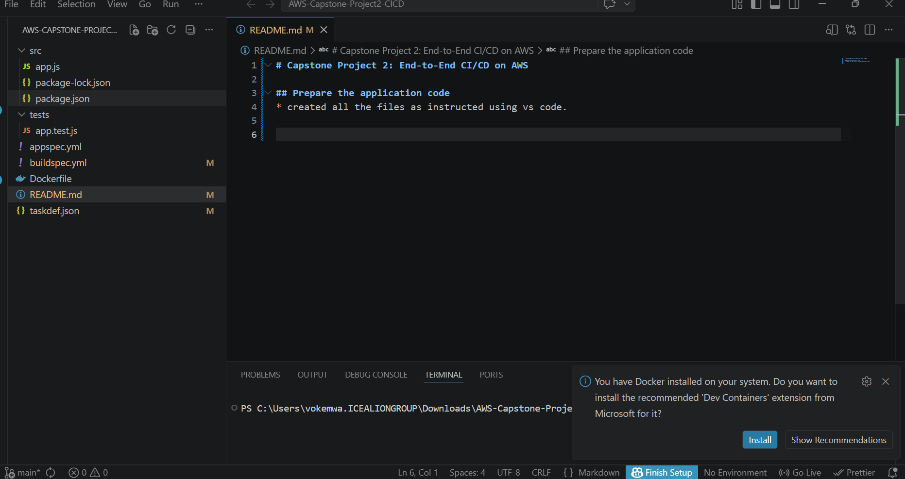
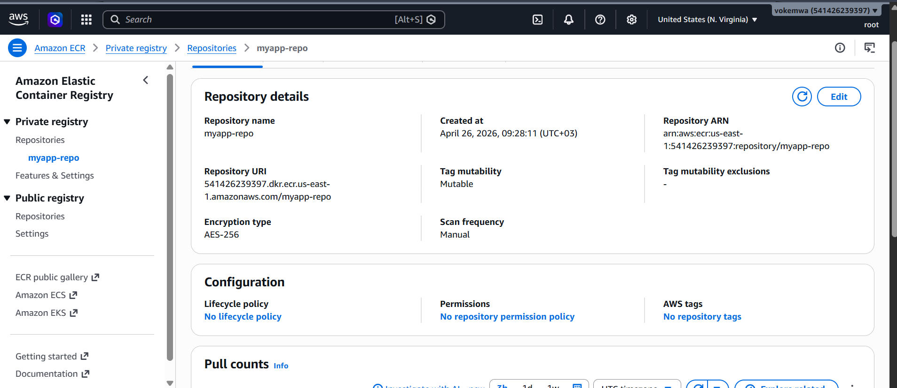
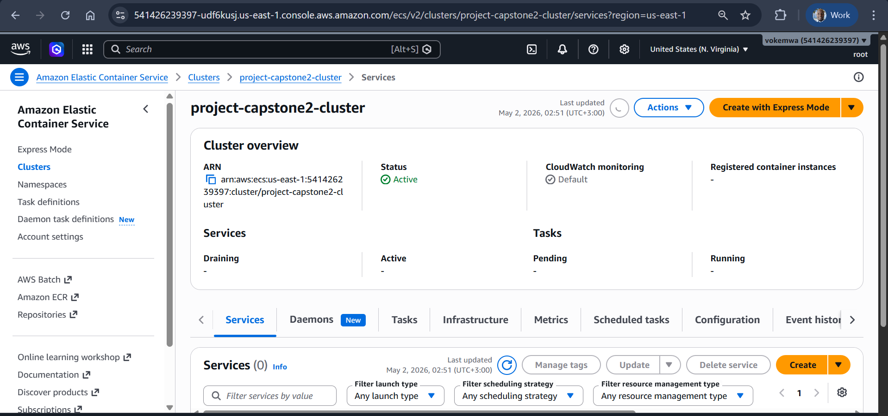

# Capstone Project 2: End-to-End CI/CD on AWS

## Prepare the application code
* created all the files as instructed using vs code as shown in the below screenshot.

## Create Elastic container registry (ECR)

* Search for ECR in the search bar
* Click the orange Create repository button
* Give it a name `myapp-repo`
* Create
* Below is the screenshot for the ECR

## Create Elastic container service (ECS)
  ### Create an ECS cluster
  * Go to ECS Clusters
  * Click create cluster
  * give it a cluster name `project-capstone2-cluster`
  * Under infrastructure, select `Fargate only`
  * Click create

  * Below is a screenshot of the cluster created

  
