# Capstone Project 2: End-to-End CI/CD on AWS

## Prepare the application code
* created all the files as instructed using vs code as shown in the below screenshot.

## Create Elastic container registry (ECR)

* Search for ECR in the search bar
* Click the orange Create repository button
* Give it a name `myapp-repo`
* Create
* Below is the screenshot for the ECR

## Create Elastic container service (ECS)
### Create an ECS cluster
* Go to ECS Clusters
* Click create cluster
* give it a cluster name `project-capstone2-cluster`
* Under infrastructure, select `Fargate only`
* Click create

* Below is a screenshot of the cluster created

  ## AWS ECS Task definition
  ### Create a task definition for the ECS cluster

  * This is a blueprint for the application that tells Amazon ECS how to run the Docker containers
  * Click `Create new task definition`
  * Give it `task definition family name` `myapplication-task`
  * Launch type `AWS Fargate`
  * Select `Task execution role`

  * Below is the screenshot of the execution role

  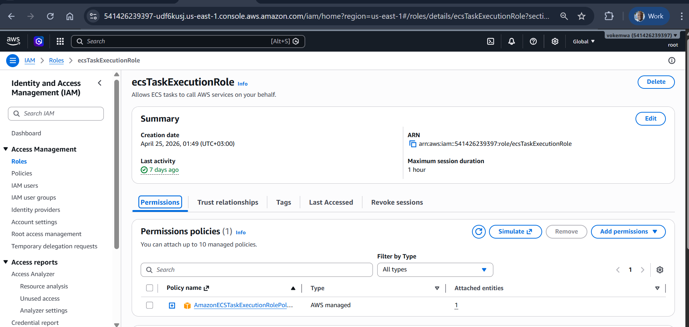

  * Under Container - 1
  * give it a name that matches the appspec.yaml file
  * Paste ECR Image url: `541426239397.dkr.ecr.us-east-1.amazonaws.com/myapp-repo`
  * Port mappings: Container port: `3000` Protocol: `TCP`, Port name: `myapplication-3000-tcp`
  * Click Create

  * Below is the screenshot for the task definition 
        
  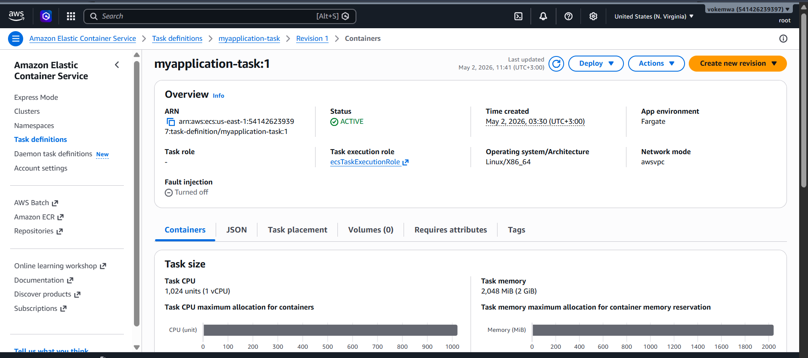

## Set up application load balancer
### PartA: Create two target groups i.e. Blue/Green
* Go to EC2 Console > Target Groups > Create target group.

* Target type: select `IP addresses`
* Set target group for Blue 
* Give it a name `application-target-group-blue`
* For protocol: `HTTP`, Port: `80`
* IP address type: `IPv4`
* VPC: `Pick default vpc`
* Do not register targets here because ECS will automatically spin up containers, get their private IP addresses and register them.
* Create target group for blue

* Here is the screenshot for blue target group

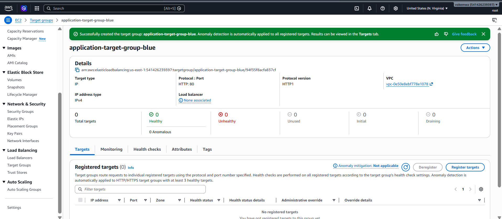

* Repeat the same for Green target group

* Below is the screenshot for green target group

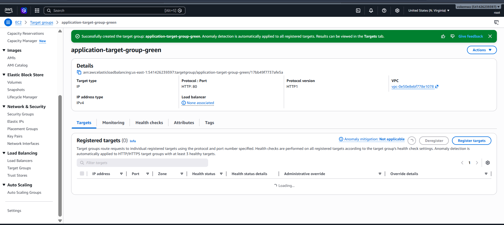

* Why are both target groups set to port `80`?
The port on a Target Group tells the Load Balancer which port your Docker container is listening on. Since your container is always listening on port 3000 (or whatever you set in your Dockerfile), both target groups are effectively just "gateways" to that same container port.

## Part B: Create security group
* Security group acts as a firewall with specific inbound rules
* Go to the EC2 Console.
* In the left-hand menu, under Network & Security, click Security Groups.
* Click the orange `Create security group` button.
* Security group name `security-group-lb`
* Description `Allow HTTP 80 and 8080 for Blue-Green deployment`
* Select `VPC` and it should be the same as the one in the target groups
### Inbound rules
Create three inbound rules:
* Type: `HTTP`	Protocol: `TCP`	Port Range: `80`	Source: `0.0.0.0/0`
* Type: `Custom TCP`	Protocol: `TCP`	Port Range: `8080`	Source: `0.0.0.0/0`
* Type: `Custom TCP`	Protocol: `TCP`	Port Range: `3000`	Source: `0.0.0.0/0`

### Outbound rules
* allow default i.e. all traffic to allow the application load balancer talk to the containers
* Click `Create security group`

* Below is the screenshot for the security group

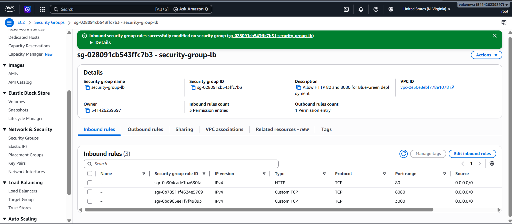

## Part C: Create application Load balancer

* Go to EC2 Console > Load Balancers > Create load balancer
* Select Application Load Balancer > Create
* Give it a name `application-loadbalancer`
* Scheme: `Internet-facing`
* Select default `VPC`
* Select at least two Subnets in different Availability Zones
* Select the security group created above `security-group-lb`

### Add listeners and Routing
* Listener1: Protocol: `HTTP`, Port: `80`, Default action: `Forward to targetgrp-blue`
* Listener2: Protocol: `HTTP`, Port: `8080`, Default action: `Forward to targetgrp-green`
* Click `Create load balancer`
* Screenshot for the load balancer

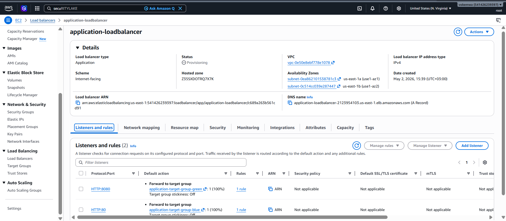

## Create an ECS service on the cluster
* I used the below script to create the service

`cat <<EOF > service-config.json`
`{` 
    `"cluster": "project-capstone2-cluster",`
    `"serviceName": "myapp-service",`
    `"taskDefinition": "myapplication-task",`
    `"loadBalancers": [`
        `{`
            `"targetGroupArn": "arn:aws:elasticloadbalancing:us-east-1:541426239397:targetgroup/application-target-group-blue/94f35f8acfa837cf",`
            `"containerName": "myapp-container",`
            `"containerPort": 3000`
        `}`
    `],`
    `"desiredCount": 1,`
    `"launchType": "FARGATE",`
    `"deploymentController": {`
        `"type": "CODE_DEPLOY"`
    `},`
    `"networkConfiguration": {`
        `"awsvpcConfiguration": {`
            `"subnets": ["subnet-0ea862101538781c3", "subnet-026189493581a9fb2"],`
            `"securityGroups": ["sg-028091cb543ffc7b3"],`
            `"assignPublicIp": "ENABLED"`
        `}`
    `}`
`}`
`EOF`

* Below is the screenshot of my service

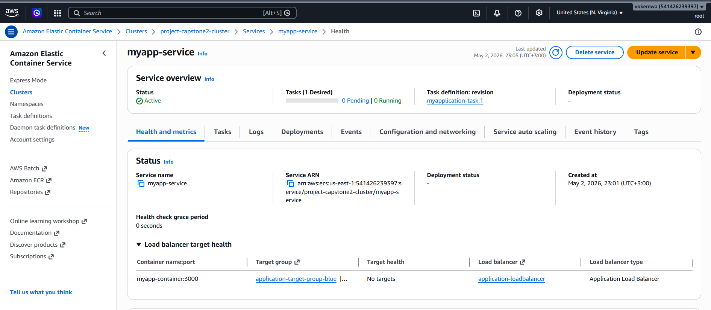

## Codedeploy configurations
* I have configured codedeploy to swap traffic between blue and green deployments
* Below is the screenshot

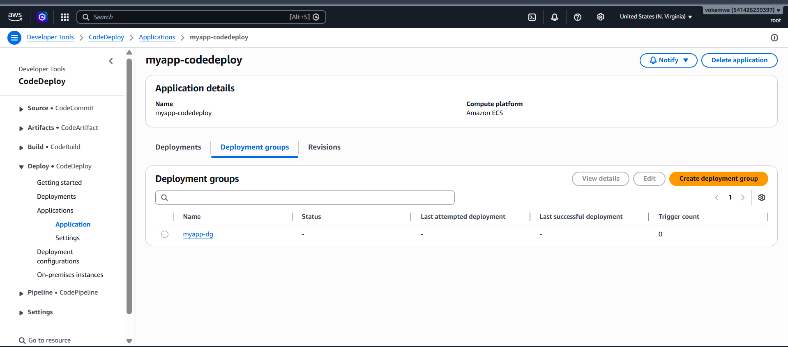

## Added for repository secret keys in github under settings

* Here is the screenshot

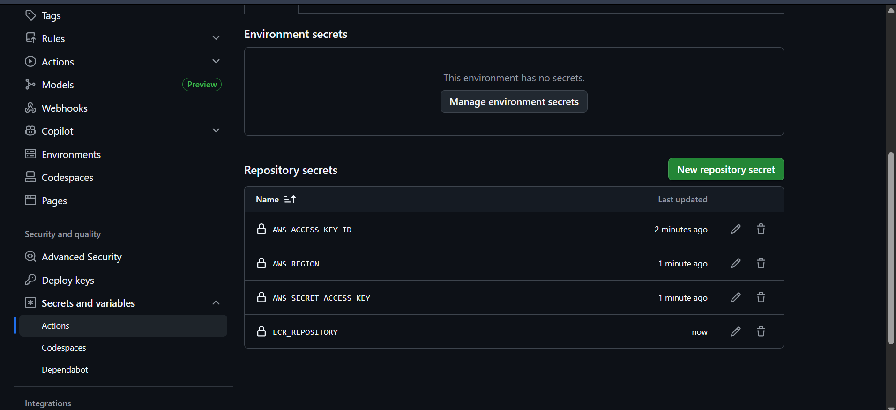

## Check the status of deploy.yaml file
my deploy.yaml file failed. Will troubleshoot

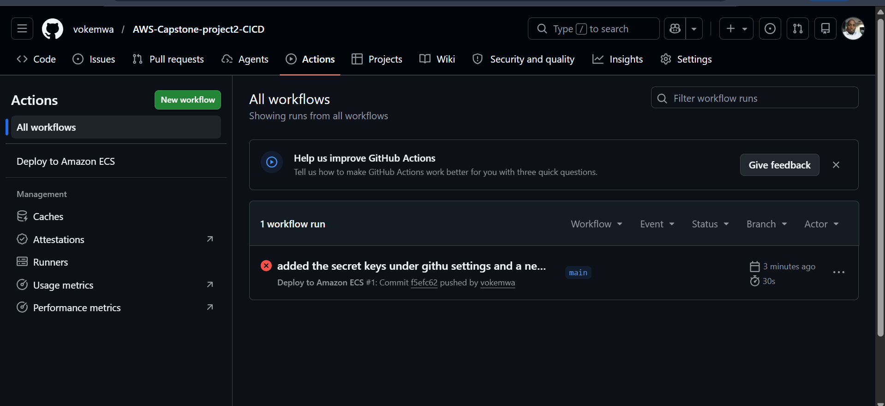

## Troubleshooting the error
This is my deploy steps in github. 

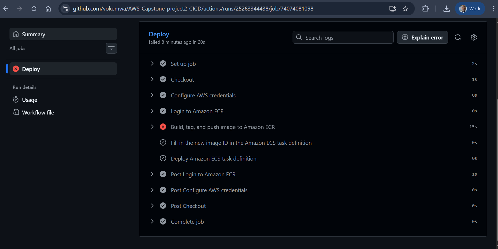

The error has moved to task definition stage

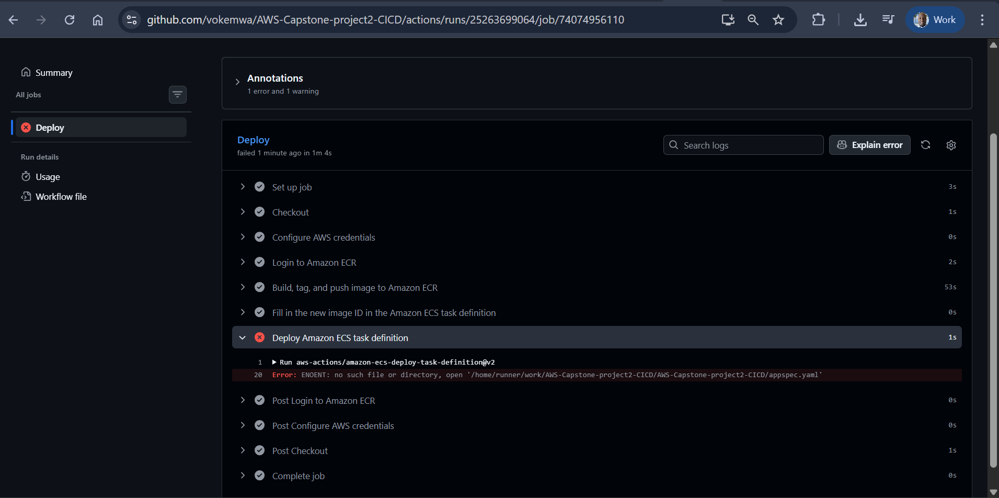

## Deployment status in progress

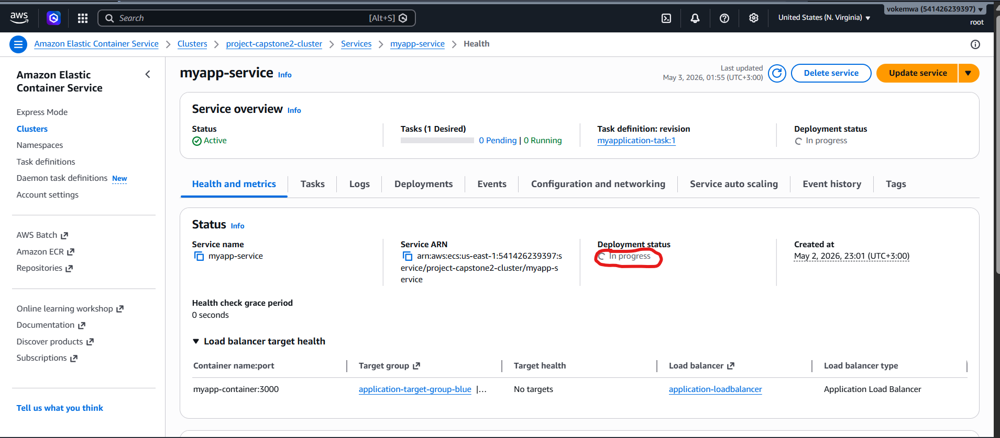

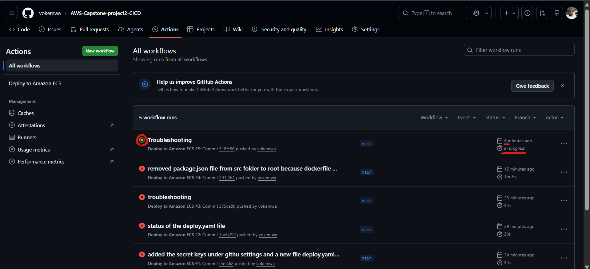

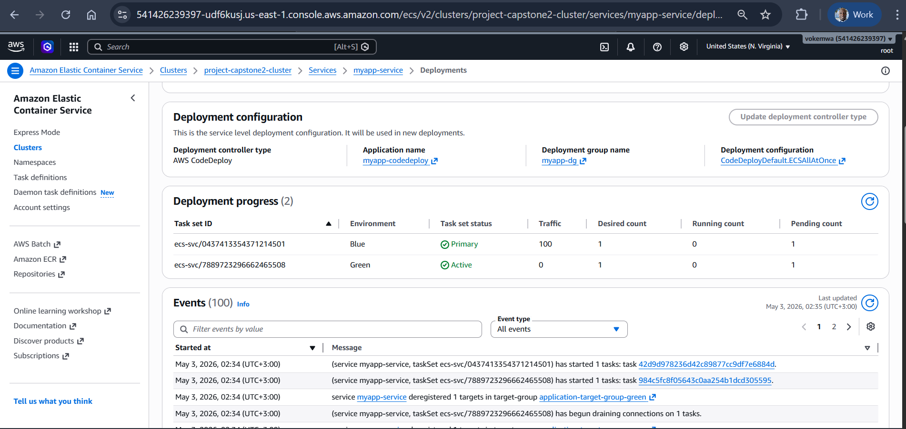

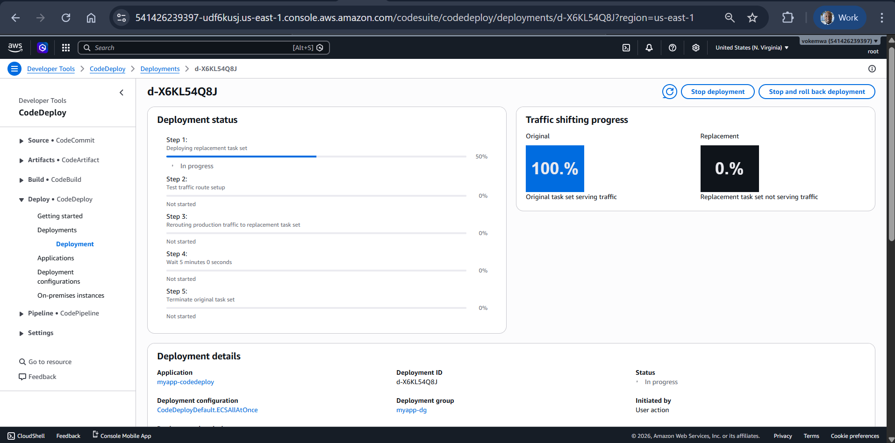